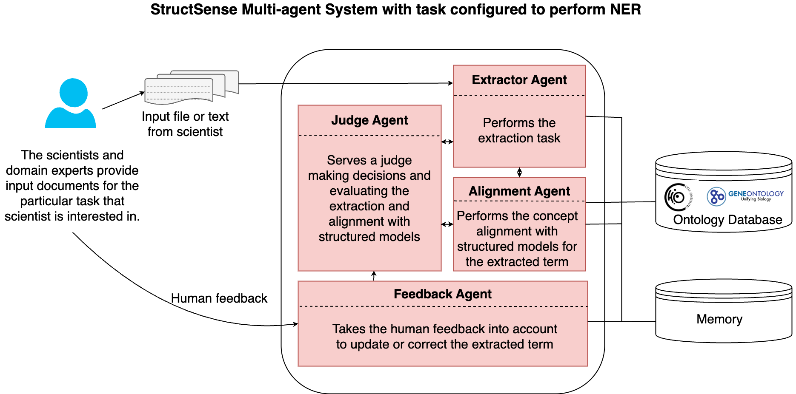

# 🧩 StructSense

Welcome to `structsense`!

`structsense` is a powerful multi-agent system designed to extract structured information from unstructured data. By orchestrating intelligent agents, it helps you make sense of complex information — hence the name *structsense*.

Whether you're working with scientific texts, documents, or messy data, `structsense` enables you to transform it into meaningful, structured insights.

**Caution:**: this package is still under development and may change rapidly over the next few weeks.


---
## 🏗️ Architecture
The below is the architecture of the `StructSense`.


---
## 🚀 Features

- 🔍 Multi-agent architecture for modular processing
  - 📑 Extraction of (structured) information from text--based on configuration
  - 🤝 Collaboration between agents
  - ⚙️ Easy use
  - 🧠 Designed as general purpose domain agnostic framework

---

## 🧠 Example Use Cases
- Entity and relation extraction from text
  - Knowledge graph construction

## 📁Examples

-  [`Using openrouter/`](./example/ner_example) 
  - You need the openrouter API key
- [`Using Ollama`](./example/ner_example_ollama) 
  - Install ollama and pull the models which you intend to use. This example uses `deepseek-r1:14b` model. You can get it from ollama by running `ollama pull deepseek-r1:14b` command. If you want to use different models, e.g., `llama3.2:latest`, you need to pull it similar to `deepseek-r1:14b`. Make sure that ollama is running. You can run ollama using `ollama serve`.
---
## 📄 Requirements
### 📄 PDF Extraction Configuration

By default, the system uses the **local Grobid service** for PDF content extraction. If you have Grobid installed locally, **no additional setup is required** — everything is preconfigured for local usage.

**Grobid Installation via Docker**
```shell
docker pull lfoppiano/grobid:0.8.0
docker run --init -p 8070:8070 -e JAVA_OPTS="-XX:+UseZGC" lfoppiano/grobid:0.8.0
```
JAVA_OPTS="-XX:+UseZGC" helps to resolve the following error in MAC OS.

---

#### 🔧 Using a Remote Grobid Server

If you're running Grobid on a **remote server**, set the following environment variable:

```bash
GROBID_SERVER_URL_OR_EXTERNAL_SERVICE=http://your-remote-grobid-server:PORT

```

### 🌐 Using an External PDF Extraction API
If you prefer to use an external PDF extraction API service, you must:

- Set the API endpoint:

  ```shell
    GROBID_SERVER_URL_OR_EXTERNAL_SERVICE=https://api.SOMEAPIENDPOINT.com/api/extract
  ```
- Enable the external API mode:
  ```shell
    EXTERNAL_PDF_EXTRACTION_SERVICE=True
  ```
> Note:
At the moment, the external API is assumed to be publicly accessible and does not require authentication (e.g., no JWT token or API key). Support for authenticated requests may be added in future versions.

---

## 📄 Configuration
`structsense` supports flexible customization through both environment variables and a YAML configuration file.

The YAML config can be passed as a parameter (e.g., `--agentconfig config/ner_agent.yaml`), allowing you to define models, agents, and behaviors specific to your use case.

### 🔧 Environment Variables

You need to set the following environment variables (e.g., in a `.env` file). WEAVIATE is a vector database that we use to store the knolwledge, which in our case is the ontology/schemas.

- WEAVIATE related environment variables are only necessary if you want to use vector database as a knowledge source.

#### 🧠 Core Keys

| Variable              | Description                                  | Default          |
|-----------------------|----------------------------------------------|------------------|
 | `ENABLE_KG_SOURCE`    | Enable access to knowledge source, i.e., vector database.| `false`|
| `WEAVIATE_API_KEY`    | **Required.** API key for Weaviate access    | —                |

#### 🌐 [Weaviate](https://weaviate.io/) Configuration
This configuration is optional and only necessary if you plan to integrate a knowledge source (e.g., a vector store) into the pipeline.

| Variable                   | Description                                  | Default   |
|---------------------------|----------------------------------------------|-----------|
| `WEAVIATE_HTTP_HOST`      | HTTP host for Weaviate                       | `localhost` |
| `WEAVIATE_HTTP_PORT`      | HTTP port for Weaviate                       | `8080`    |
| `WEAVIATE_HTTP_SECURE`    | Use HTTPS for HTTP connection (`true/false`) | `false`   |
| `WEAVIATE_GRPC_HOST`      | gRPC host for Weaviate                       | `localhost` |
| `WEAVIATE_GRPC_PORT`      | gRPC port for Weaviate                       | `50051`   |
| `WEAVIATE_GRPC_SECURE`    | Use secure gRPC (`true/false`)              | `false`   |

#### 🧪 Weaviate Timeouts 

| Variable                   | Description                                  | Default   |
|---------------------------|----------------------------------------------|-----------|
| `WEAVIATE_TIMEOUT_INIT`   | Timeout for initialization (in seconds)     | `30`      |
| `WEAVIATE_TIMEOUT_QUERY`  | Timeout for query operations (in seconds)   | `60`      |
| `WEAVIATE_TIMEOUT_INSERT` | Timeout for data insertions (in seconds)    | `120`     |

#### 🤖 Ollama Configuration for WEAVIATE

| Variable              | Description                                   | Default                                 |
|-----------------------|-----------------------------------------------|-----------------------------------------|
| `OLLAMA_API_ENDPOINT` | API endpoint for Ollama model                 | `http://host.docker.internal:11434`     |
| `OLLAMA_MODEL`        | Name of the Ollama embedding model            | `nomic-embed-text`                      |

> ⚠️ **Note**:  If ollama is running in host machine and vector database, i.e., WEAVIATE, in docker, then we use `http://host.docker.internal:11434`, which is also the default value. However, if both are running in docker in the same host, use `http://localhost:11434 `.
#### 🧵 Optional: Experiment Tracking

| Variable               | Description                                                                | Default           |
|------------------------|----------------------------------------------------------------------------|-------------------|
| `ENABLE_WEIGHTSANDBIAS` | Enable [Weights & Biases](https://wandb.ai/site) monitoring (`true/false`) | `false`           |
| `ENABLE_MLFLOW`        | Enable [MLflow](https://mlflow.org/) logging (`true/false`)                | `false`           |
| `MLFLOW_TRACKING_URL`  | MLflow tracking server URL                                                 | `http://localhost:5000` |
> ⚠️ **Note**: `WEAVIATE_API_KEY` is **required** for `structsense` to run. If it's not set, the system will raise an error.
>   For Weights & Biases you need to create a project and provide it's key.


```shell
# Example .env file

WEAVIATE_API_KEY=your_api_key
WEAVIATE_HTTP_HOST=localhost
WEAVIATE_HTTP_PORT=8080
WEAVIATE_HTTP_SECURE=false

WEAVIATE_GRPC_HOST=localhost
WEAVIATE_GRPC_PORT=50051
WEAVIATE_GRPC_SECURE=false

WEAVIATE_TIMEOUT_INIT=30
WEAVIATE_TIMEOUT_QUERY=60
WEAVIATE_TIMEOUT_INSERT=120

OLLAMA_API_ENDPOINT=http://host.docker.internal:11434
OLLAMA_MODEL=nomic-embed-text

ENABLE_WEAVE=true
ENABLE_MLFLOW=true
MLFLOW_TRACKING_URL=http://localhost:5000
```
#### 🛠️ Minimum Required Environment Variables

Below are the **minimum required environment variables** to run `structsense`.  
This configuration assumes all other optional variables will use their default values.

In this minimal setup:

- 🚫 **Weights & Biases** is disabled  
  - 🚫 **MLflow tracking** is disabled  
  - 🚫 **Knowledge source integration** is disabled  
  - 📦 As a result, **no vector database** (e.g., Weaviate) is used

```shell 
ENABLE_WEIGHTSANDBIAS=false
ENABLE_MLFLOW=false
ENABLE_KG_SOURCE=false  
```
---

### 📄 YAML Configuration
In order to run `structsense` you need 5 YAML configuration files.
- The first is the `agent configuration`.
  - The agent configuration. You can define as many agents as you want, we process it dynamically.
    - Example agent configuration.
      ```yaml 
      agents:
        - id: extractor_agent
          output_variable: extracted_info
          role: >
            [Entity Extraction Agent]
          goal: >
            Perform Named Entity Recognition (NER) or entity extraction on {input_data} and return structured JSON output.
          backstory: >
            You are an AI assistant specialized in information extraction for a specific domain. 
            Your expertise includes identifying and classifying entities relevant to the task, such as concepts, locations, people, or other domain-specific items. 
            You respond strictly in structured JSON to ensure compatibility with downstream systems.
          llm:
            model: openrouter/openai/gpt-4o-2024-11-20
            base_url: https://openrouter.ai/api/v1
            frequency_penalty: 0.1
            temperature: 0.7
            seed: 53
            api_key: YOUR_API_KEY_HERE  # Replace with your actual API key or use env var
      
          - id: alignment_agent
            output_variable: aligned_entities
            role: >
              [Concept Alignment Agent]
            goal: >
              Align extracted entities from {extracted_info} with domain-specific ontologies or schema models and return structured JSON.
            backstory: >
              You are an AI assistant with expertise in linking extracted terms to formal knowledge representations such as taxonomies, schemas, or ontologies. 
              Your responses help enrich and normalize the raw extracted data for semantic interoperability.
            llm:
              model: openrouter/openai/gpt-4o-2024-11-20
              base_url: https://openrouter.ai/api/v1
              frequency_penalty: 0.1
              temperature: 0.7
              seed: 53
              api_key: YOUR_API_KEY_HERE
    
          - id: judge_agent
            output_variable: reviewed_output
            role: >
              [Judgment & Scoring Agent]
            goal: >
              Evaluate the {aligned_entities} based on predefined criteria and return structured feedback and scores in JSON format.
            backstory: >
              You are an evaluation-focused AI agent that reviews entity alignment or extraction quality based on accuracy, consistency, or relevance. 
              You assign a confidence score (e.g., from 0 to 1) and provide justification or flags where applicable.
            llm:
              model: openrouter/openai/gpt-4o-2024-11-20
              base_url: https://openrouter.ai/api/v1
              frequency_penalty: 0.1
              temperature: 0.7
              seed: 53
              api_key: YOUR_API_KEY_HERE 
        ```
    - In the YAML file: 
        - **ID**: Unique identifier
        - **Goal**: Task to be performed
        - **LLM config**: Model, base URL, temperature, etc.
        - **Backstory**: Background knowledge the agent leverages
        - **Output variable**: Result name for the next agent/task
      
    For further details, refer to [Role-Goal-Backstory](https://docs.crewai.com/guides/agents/crafting-effective-agents#core-principles-of-effective-agent-design)
- The second is the `task configuration`.
  - Task configuration allows you to describes the tasks for the agent. 
     - Example task configuration.
       ```yaml
         tasks:
           - id: entity_extraction
             description: >
               From the given input {input_data}, extract named entities relevant to your domain.
               A named entity is any term or phrase that refers to a specific concept, such as a person, place, organization, species, anatomical region, or event.
    
               Input:
               {input_data}
             expected_output: >
               Format: JSON
               Example:
               {
                 "extracted_terms": {
                   "1": [
                     {
                       "entity": "example entity",
                       "label": "ENTITY_TYPE",
                       "sentence": "This is the sentence where the entity appears.",
                       "start": 10,
                       "end": 25,
                       "source_metadata": {
                         "title": "Source Title",
                         "section": "methods",
                         "doi": "doi-or-id"
                       }
                     }
                   ]
                 }
               }
             agent_id: extractor_agent
    
           - id: concept_alignment
             description: >
               Take the output from the extraction step {extracted_info} and align each entity to a matching concept 
               in a domain-specific ontology or schema. Use concept identifiers and labels where possible.
    
             expected_output: >
               Format: JSON
               Example:
               {
                 "aligned_terms": {
                   "1": [
                     {
                       "entity": "example entity",
                       "label": "ENTITY_TYPE",
                       "ontology_id": "ONTO:0000001",
                       "ontology_label": "Mapped Concept Label",
                       "sentence": "Original sentence text.",
                       "start": 10,
                       "end": 25,
                       "source_metadata": {
                         "title": "Source Title",
                         "section": "methods",
                         "doi": "doi-or-id"
                       }
                     }
                   ]
                 }
               }
             agent_id: alignment_agent
    
           - id: alignment_judgment
             description: >
               Take the aligned output {aligned_terms} and evaluate each mapping based on domain knowledge and matching quality.
               Assign a score between 0 and 1 (higher is better), and embed the score into the aligned result.
    
             expected_output: >
               Format: JSON
               Example:
               {
                 "judged_terms": {
                   "1": [
                     {
                       "entity": "example entity",
                       "label": "ENTITY_TYPE",
                       "ontology_id": "ONTO:0000001",
                       "ontology_label": "Mapped Concept Label",
                       "sentence": "Original sentence text.",
                       "start": 10,
                       "end": 25,
                       "judge_score": 0.85,
                       "source_metadata": {
                         "title": "Source Title",
                         "section": "methods",
                         "doi": "doi-or-id"
                       }
                     }
                   ]
                 }
               }
             agent_id: judge_agent 
       ```
     - Each task links to a specific agent via `agent_id` and defines:
       - **Description**: What the task does
       - **Input/Output schema**: Example output structure in JSON
       - **Agent Link**: Tied to an `id` from `agents configuration`
       - 
       > ⚠️ **Note**:  The variables {variable_name} are replaced at the run-time. Also, pay attention in the tasks where we are using the output variable defined in `agent configuration`.

- The third is the `flow configuration`

  - Creates the flow on how the tasks are executed. Even though we see it sequential, since the memory has been setup at a crew level, the details are shared across the agents while performing the tasks.

  ```yaml
  flow:
    - id: extracted_structured_information
      agent_key: extractor_agent #should match the agent configuration
      task_key: ner_extraction #should match the task configuration
      inputs:
        literature: "{{source_text}}"  # still comes from runtime. Do not change this variable name
  
      - id: align_structured_information
        agent_key: alignment_agent
        task_key: ner_alignment
        inputs:
          extracted_info: "{{extracted_info}}"  #  comes from agent's output_variable
        knowledge_source: extracted_info        #  match output_variable from previous step i.e., extractor_agent and is used to get content from the vector db
  
      - id: judge_alignment
        agent_key: judge_agent
        task_key: ner_judgment
        inputs:
          aligned_structured_terms: "{{aligned_structured_terms}}"
        knowledge_source: aligned_structured_terms
  ```
- The fourth is the `embedding configuration` For more about the different embedding configurations using different provider see [https://docs.crewai.com/concepts/memory#additional-embedding-providerscl](https://docs.crewai.com/concepts/memory#additional-embedding-providerscl).
  ```yaml
  embedder_config:
    provider: ollama
    config:
      api_base: http://localhost:11434
      model: nomic-embed-text:latest
  ``` 
- The fifth and the final one is the `search configuration`, where we define the search keys. Since the ontology/schemas are our current knowledge source, which is why you see the label and entity as search key. _This is optional if you do not use knowledge source._
  ```yaml
  search_key: #local vector database
    - entity
    - label
  ```

## 📦 Installation
Install this package via :

```sh
pip install structsense
```

Or get the newest development version via:

```sh
pip install git+https://github.com/sensein/ner_framework.git
```

### 🧪 CLI Usage

You can run `StructSense` using the CLI tool `structsense-cli`. Below are a few examples showing different ways to provide input.

---

#### 📄 1. Extract from a PDF file (with knowledge source)

```bash
structsense-cli extract \
  --agentconfig config/your_agent.yaml \
  --taskconfig config/your_agent_task.yaml \
  --embedderconfig config/embedding.yaml \
  --flowconfig config/agent_processing_flow.yaml \
  --knowledgeconfig config/search_ontology_knowledge.yaml \
  --source someliterature.pdf
```
#### 💬 2. Extract from raw text (with knowledge source)

```shell
structsense-cli extract \
  --agentconfig config/your_agent.yaml \
  --taskconfig config/your_agent_task.yaml \
  --embedderconfig config/embedding.yaml \
  --flowconfig config/agent_processing_flow.yaml \
  --knowledgeconfig config/search_ontology_knowledge.yaml \
  --source "Additionally, mutations in the APOE gene have been linked to neurodegenerative disorders, impacting astrocytes and microglia function."
```

#### ⚡ 3. Extract from raw text (minimal setup without knowledge source)

```shell
structsense-cli extract \
  --agentconfig config/your_agent.yaml \
  --taskconfig config/your_agent_task.yaml \
  --embedderconfig config/embedding.yaml \
  --flowconfig config/flow_ner.yaml \
  --source "Additionally, mutations in the APOE gene have been linked to neurodegenerative disorders, impacting astrocytes and microglia function."
```

## In progress
- [X] [`More examples (e.g., using ollama)`](example/ner_example_ollama)
- [ ] Validations (e.g., benchmarking)
- [ ] Human feedback component.